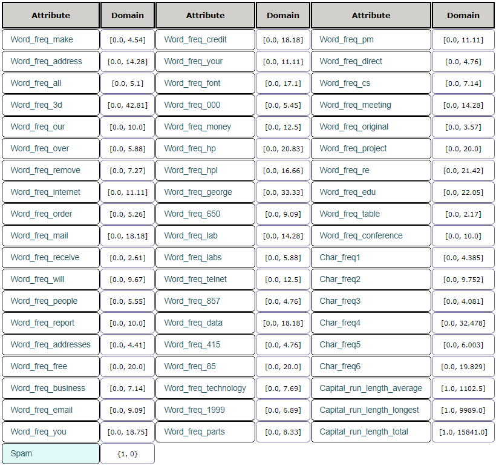

# Machine-Learning

This repo contains 3 projects regarding the fundamental machine learning algorithms. in the first two projects, we will be implementing these algorithms in Python from scratch. This helps understand what each algorithm actually does, which gives us an insight into how to leverage them in the best way. In the final project, we use a few of these algorithms for a real-world problem: **Spam Detection in Emails**.

## Introduction

One of the main aspects of a great email application or client is its ability to accurately detect all spams. This is, arguably, the main feature users look for. This is where machine learning shows its strength. In this project we will evaluate and compare different classification algorithms and demonstrate how well they can detect spams. The inputs of these algorithms are some features extracted from the email, which we will go through in the Data Exploration section. We pass these features on to different algorithms to see which can do a better job at classification. Now, how can we decide which algorithm has a higher performance (or lower error)? Next, we will talk about our metrics.

## Metrics

One simple common way for evaluating classifiers is the accuracy percentage. This numeric metric is obtained simply by dividing the number of correctly classified samples by the total number of samples. Among other evaluation metrics, Recall, Precision, and F1 score could also be very helpful, especially if the dataset is highly unbalanced.

With regards to Statistical Significance, we can use the Student's t-test to compare different models' performances. We will apply this test to all our metrics (test set accuracy, precision, recall, and f1 score).

## Data Exploration

The dataset used in this project is the "Spambase data set" found on the KEEL dataset website. Table 1 demonstrates the outline of this dataset:

_Table 1_
| Number of classes | Total number of samples | Number of samples per class | Number of features | Feature value types |
| --- | --- | --- | --- | --- |
| 2 | 4,597 | 1,812 (1), 2,785 (0) | 57 | Real |

This database contains information about 4597 email messages. Most of the features indicate whether a particular word or character was frequently occurring in the email. Here are the definitions of the features:

- 48 continuous real attributes of type word\_freq\_&quot;WORD&quot; = percentage of words in the e-mail that match &quot;WORD&quot;. A &quot;word&quot; in this case is any string of alphanumeric characters bounded by non-alphanumeric characters or end-of-string.
- 6 continuous real attributes of type char\_freq\_&quot;CHAR&quot; = percentage of characters in the e-mail that match &quot;CHAR&quot;.
- 1 continuous real attribute of type Capital\_run\_length\_average = average length of uninterrupted sequences of capital letters.
- 1 continuous integer attribute of type Capital\_run\_length\_longest = length of longest uninterrupted sequence of capital letters.
- 1 continuous integer attribute of type Capital\_run\_length\_total = total number of capital letters in the e-mail.

Therefore, the dataset would be as described in Figure 1.

We will use the Pandas and NumPy libraries to import and manipulate the data, while using the Matplotlib library to visualize it.

_Figure 1: Spambase dataset_

## Algorithms

The following supervised machine learning algorithms are used to build the classifiers:

- **Neural Networks** : This type of classifiers can be highly complex. By adding multiple layers and units, we can estimate the most complicated relations between features and labels. Now a days, these are the first choice for various problems.
- **Decision Trees** : Although not as powerful as neural networks, decision trees might still be a good choice, specially if the relationship between the features and labels is not very complex. These types of classifiers are relatively shallow, and easily interpreted.
- **SVM** : SVM uses a kernel to transform the data. Using those transformations, SVM models can capture relatively complex relationships between features and labels.

We will choose the best of each of the algorithms above, and then proceed to the comparison between the three. Please note that logistic regression was replaced with SVM because of a much better overall performance.

## Methodology

In order to compare different classifiers, we can use the leave-one-out cross-validation method, which means we split the data into k folds and each time all algorithms are trained on k-1 folds and the accuracy is evaluated on the remaining fold. This process is repeated k times and we consider k accuracies for each algorithm to determine which has the best performance.

Alternatively, if the dataset is big enough, we can compare performances on a separate hold-out set (test set), and use training and validation sets for hyperparameter tuning.

In this project, we will follow the first methodology for comparison. We first do the hyperparameter tuning, individually for each model, by compare different versions of the model using the 10-fold cross-validation method. When parameters are tuned, we will proceed to compare the best of each of the 3 classifiers.

## Results

### Hyperparameter Tuning

In the hyperparameter tuning process, there were numerous parameters that could be changed, specially for neural networks. Although, almost all these parameters were tested to find the best model for each algorithm, only a few will be mentioned here, for the sake of comparison and analysis. Please note that the train and test accuracies mentioned here are the average of the 10-fold cross-validation.

#### Neural Networks:

The following hyperparameters are considered, with Table 2 showing the results: number of hidden layers (1, 2) – number of units in each layer (32, 64) – activation function in hidden layers (ReLU, Tanh) – L2 regularization

_Table 2_

| **Number of Layers** | **Number of Units** | **Activation Function** | **l2 Regularizer** | **Train accuracy** | **Test accuracy** |
| --- | --- | --- | --- | --- | --- |
| 1 | 32 | ReLU | 0.0001 | 93.7 % | 93.1 % |
| 1 | 64 | ReLU | 0.0001 | 93.8 % | 92.8 % |
| 2 | 32 | ReLU | 0.0001 | 93.6 % | 92.8 % |
| 2 | 64 | ReLU | 0.0001 | 93.7 % | 92.6 % |
| 1 | 32 | Tanh | 0.0001 | 96 % | 94 % |
| 1 | 32 | Tanh | 0.01 | 95.7 % | 94.2 % |

Table 2 indicates our best hyperparameters: 1 hidden layer containing 32 units, Tanh activation function, and regularizer parameter = 0.01. we can see how regularization has helped reduce overfitting and get a better result on the test set.

#### Decision Tree:

Two of the main hyperparameters in Decision trees are considered here: max depth, and min samples per leaf. Both have regularizing effects and come in handy when the model is overfitting. In order to have a stronger regularizing effect, max depth should be decreased, and min samples per leaf should be increased. Table 3 demonstrates the results:

_Table 3_

| **Max Depth** | **Min Samples per Leaf** | **Train accuracy** | **Test accuracy** |
| --- | --- | --- | --- |
| None | 1 | 99.9 % | 91.3 % |
| None | 5 | 96.2 % | 91.5 % |
| 15 | 1 | 98.2 % | 92.3 % |
| 15 | 5 | 96 % | 91.5 % |

Although the table shows only a few values for the parameters, a wide range of values were tested. The results showed that even though the decision tree with no max depth and 1 for min samples per leaf seems to be overfitting, it still delivers the best performance on the test set.

We can consider Random Forests as well. A random forest is a meta estimator that fits a number of decision tree classifiers on various sub-samples of the dataset and uses averaging to improve the predictive accuracy and control over-fitting. Table 4 shows the corresponding results for a random forest with 100 estimators.

_Table 4_

| **Max Depth** | **Min Samples per Leaf** | **Train accuracy** | **Test accuracy** |
| --- | --- | --- | --- |
| None | 1 | 99.9 % | 95.6 % |
| None | 5 | 96.8 % | 94.5 % |
| 15 | 1 | 98.8 % | 94.9 % |
| 15 | 5 | 96.4 % | 94.3 % |

It is obvious that the best model here would be a random forest with max depth = None and min samples per leaf = 1.

#### SVM:

Hyperparameters analyzed here were as follows: kernel (&#39;linear&#39;, &#39;rbf&#39;), and gamma (&#39;auto&#39;, &#39;scale&#39;). Table 5 describes the results:

_Table 5_

| **kernel** | **gamma** | **Train accuracy** | **Test accuracy** |
| --- | --- | --- | --- |
| rbf | auto | 94 % | 84% |
| linear | auto | 93.5 % | 93.2 % |
| rbf | scale | 79 % | 77 % |
| linear | scale | 93.5% | 93.1% |

Our best model here seems to have a linear kernel with gamma=&#39;auto&#39;.

#### Comparing the Best Models

The results of the 10-fold cross-validation using the 3 classifiers are shown in tables 6, 7, and 8.

_Table 6: Neural Networks_

| **Neural Net** | **Train accuracy** | **Test accuracy** | **Precision** | **recall** | **F1 score** |
| --- | --- | --- | --- | --- | --- |
| K0 | 0.95455644 | 0.94565217 | 0.95375723 | 0.90659341 | 0.92957746 |
| K1 | 0.95431472 | 0.93695652 | 0.9047619 | 0.93956044 | 0.92183288 |
| K2 | 0.95117235 | 0.93043478 | 0.91160221 | 0.91160221 | 0.91160221 |
| K3 | 0.95262267 | 0.9326087 | 0.91666667 | 0.91160221 | 0.91412742 |
| K4 | 0.95358956 | 0.93043478 | 0.91160221 | 0.91160221 | 0.91160221 |
| K5 | 0.94657965 | 0.95 | 0.92473118 | 0.95027624 | 0.9373297 |
| K6 | 0.94053662 | 0.9326087 | 0.89893617 | 0.93370166 | 0.91598916 |
| K7 | 0.94852586 | 0.96732026 | 0.95604396 | 0.96132597 | 0.95867769 |
| K8 | 0.95360077 | 0.95642702 | 0.93989071 | 0.95027624 | 0.94505495 |
| K9 | 0.95843403 | 0.93028322 | 0.89839572 | 0.9281768 | 0.91304348 |
| Mean | 0.9514 | 0.9413 | 0.9216 | 0.9305 | 0.9259 |

_Table 7: Decision Tree_

| **Decision Tree** | **Train accuracy** | **Test accuracy** | **Precision** | **recall** | **F1 score** |
| --- | --- | --- | --- | --- | --- |
| K0 | 0.99927484 | 0.96304348 | 0.96610169 | 0.93956044 | 0.95264624 |
| K1 | 0.99951656 | 0.93913043 | 0.94252874 | 0.9010989 | 0.92134831 |
| K2 | 0.99927484 | 0.94782609 | 0.94350282 | 0.92265193 | 0.93296089 |
| K3 | 0.99951656 | 0.95217391 | 0.96491228 | 0.91160221 | 0.9375 |
| K4 | 0.99927484 | 0.94565217 | 0.95348837 | 0.90607735 | 0.92917847 |
| K5 | 0.99927484 | 0.96521739 | 0.96610169 | 0.94475138 | 0.95530726 |
| K6 | 0.99951656 | 0.95434783 | 0.9494382 | 0.93370166 | 0.94150418 |
| K7 | 0.99927501 | 0.97603486 | 0.97752809 | 0.96132597 | 0.96935933 |
| K8 | 0.99951667 | 0.96078431 | 0.95530726 | 0.94475138 | 0.95 |
| K9 | 0.99975834 | 0.94553377 | 0.92391304 | 0.93922652 | 0.93150685 |
| Mean | 0.9994 | 0.9550 | 0.9543 | 0.9305 | 0.9421 |

_Table 8: SVM_

| **svm** | **Train accuracy** | **Test accuracy** | **Precision** | **recall** | **F1 score** |
| --- | --- | --- | --- | --- | --- |
| K0 | 0.93473532 | 0.9326087 | 0.94674556 | 0.87912088 | 0.91168091 |
| K1 | 0.93594392 | 0.92173913 | 0.91477273 | 0.88461538 | 0.89944134 |
| K2 | 0.93594392 | 0.91304348 | 0.89830508 | 0.87845304 | 0.88826816 |
| K3 | 0.93594392 | 0.93913043 | 0.95808383 | 0.8839779 | 0.91954023 |
| K4 | 0.9357022 | 0.92173913 | 0.90960452 | 0.88950276 | 0.89944134 |
| K5 | 0.93497704 | 0.93913043 | 0.93220339 | 0.91160221 | 0.92178771 |
| K6 | 0.93425187 | 0.94130435 | 0.9375 | 0.91160221 | 0.92436975 |
| K7 | 0.93160947 | 0.95860566 | 0.94505495 | 0.95027624 | 0.9476584 |
| K8 | 0.9340261 | 0.94117647 | 0.93258427 | 0.91712707 | 0.92479109 |
| K9 | 0.93716771 | 0.91067538 | 0.88461538 | 0.88950276 | 0.88705234 |
| Mean | 0.9350 | 0.9319 | 0.9259 | 0.8996 | 0.9124 |

### T-test

Table 9 indicates the Student&#39;s t-test calculated for each of our metrics.

_Table 9: T-test_

| **t-test p-values** | **Test Accuracy** | **Precision** | **Recall** | **F1 Score** |
| --- | --- | --- | --- | --- |
| NN – Decision Tree | 0.0214 | 0.0010 | 0.9997 | 0.0307 |
| NN – SVM | 0.1526 | 0.6723 | 0.0045 | 0.1062 |
| SVM – Decision Tree | 0.0010 | 0.0049 | 0.0044 | 0.0010 |

If the calculated p-value is below the threshold chosen for statistical significance (usually 0.10), then the null hypothesis is rejected in favor of the alternative hypothesis.

- Null hypothesis: The true means of the algorithms are the same.
- Alternative hypothesis: There is a significant difference between the algorithms.

As we anticipated, when comparing either of Neural Net and SVM with the Decision Tree, the test shows significant difference (almost all those values are well below 0.10), pointing out the better performance of the decision tree over the other two. As for the values regarding the comparison of Neural Net and SVM, almost all show there is no significant difference.

## Conclusion

The results of this experiment well demonstrated the better performance of the Decision tree (a Random Forest in our case) over the Neural Net and SVM classifiers. It should also be mentioned that the Random forest took less time out of all tree to be trained. The Neural Net and the SVM models did relatively the same, although, in terms of the run time, SVM was much slower, specially when using a linear kernel. Hence, the SVM classifier should be regarded here as the worst.

One of the things we can focus on in future works, is the complexity of the Neural Networks model. We can increase both the number of layers and the nodes in each layer, however, this requires much more computational power. We might also need to use a larger dataset in order to generalize well to unseen data. Another effective change that we can investigate, would be the extraction of more features from emails, e.g. the existence of particular phrases or sentences, and the number of web links each email contains.
